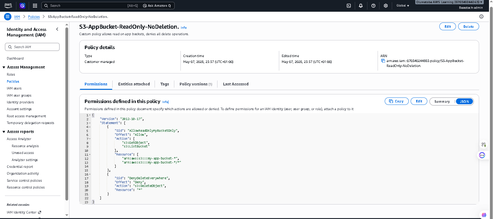
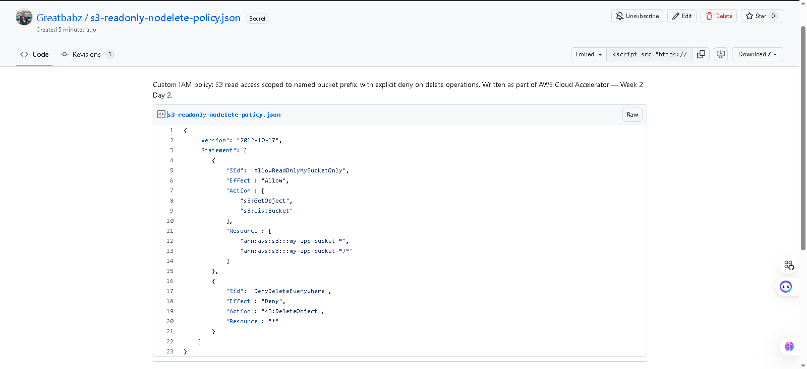
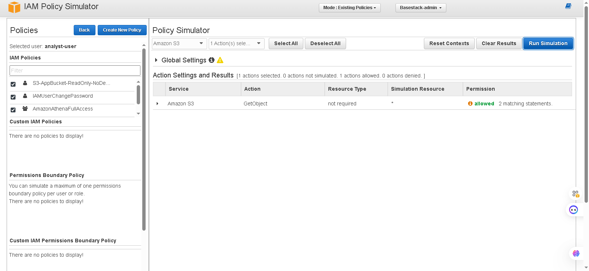
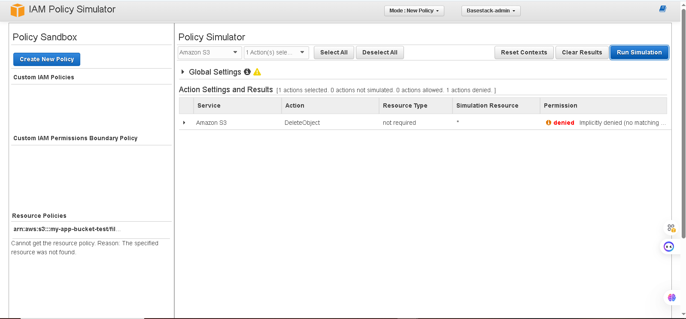

# AWS IAM Policy Simulator Lab

## Overview

This project demonstrates the creation and testing of a custom AWS IAM policy designed to:

- Allow read-only access to selected Amazon S3 buckets  
- Restrict access using wildcard bucket naming conventions  
- Explicitly deny object deletion across all S3 buckets  

The project also demonstrates the use of the AWS IAM Policy Simulator to validate IAM permissions and authorization behavior.

---

## Architecture / Workflow

1. IAM policy is created in the AWS IAM console  
2. Policy is attached to a test IAM user (`analyst-user`)  
3. AWS IAM Policy Simulator is used to validate permissions  
4. Access is tested for allowed and denied scenarios  
5. Results are documented with screenshots  
6. Policy is published via GitHub Gist for versioning and sharing  

---

## Objectives

- Understand IAM policy structure  
- Learn least-privilege access control  
- Practice resource-based permission scoping  
- Test IAM permissions using the AWS Policy Simulator  
- Implement explicit deny security controls  

---

## IAM Policy Used

```json
{
  "Version": "2012-10-17",
  "Statement": [
    {
      "Sid": "AllowReadOnlyMyBucketOnly",
      "Effect": "Allow",
      "Action": [
        "s3:GetObject",
        "s3:ListBucket"
      ],
      "Resource": [
        "arn:aws:s3:::my-app-bucket-*",
        "arn:aws:s3:::my-app-bucket-*/*"
      ]
    },
    {
      "Sid": "DenyDeleteEverywhere",
      "Effect": "Deny",
      "Action": "s3:DeleteObject",
      "Resource": "*"
    }
  ]
}
```

---

## Key IAM Concepts Demonstrated

### Wildcard Resource Matching

This allows access only to buckets whose names begin with: my-app-bucket-*

### Explicit Deny

`"Effect": "Deny"`

In AWS IAM, Explicit Deny always overrides Allow permissions.

This ensures deletion is blocked everywhere, even if other policies allow it.

---

## Policy Simulation Results

### 1. Custom Policy Created in IAM Console


---

### 2. GitHub Gist Published


---

### 3. Allowed — GetObject on Approved Bucket


---

### 4. Denied — GetObject on Unapproved Bucket


---

### 5. Denied — DeleteObject (Explicit Deny)


---

## Skills Demonstrated

- AWS Identity and Access Management (IAM)
- Amazon S3 Access Control
- Principle of Least Privilege
- IAM Policy Simulator
- JSON Policy Writing
- GitHub Documentation
- Cloud Security Fundamentals

---

## Key Learning Outcome

This project demonstrates how IAM policies can be tightly controlled using:

- Resource scoping with wildcards
- Action-based permissions
- Explicit-deny rules for security enforcement

It simulates a real-world cloud security scenario where access must be restricted while preventing destructive operations.

---

## Author

**Oluwatoba Peter Babalola**  
AWS Cloud Accelerator — Week 2 Day 2 Lab

